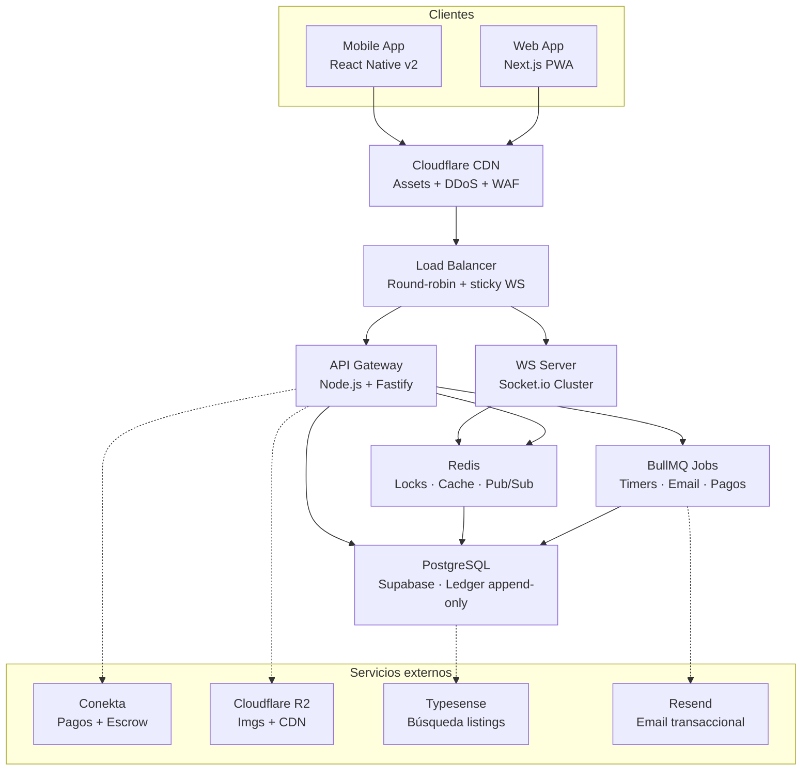
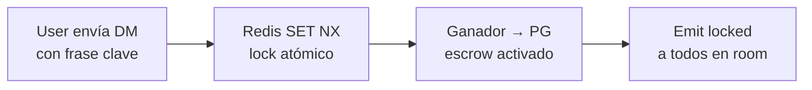

# Marketplace C2C de Coleccionables

> **PRD v1.0 · Confidencial**  
> Documento de Requerimientos · Arquitectura · UX · Stack Tecnológico

## Tabla de contenidos

- [Historias de usuario](#historias-de-usuario)
  - [Módulo 1 — Sistema de Reputación](#módulo-1--sistema-de-reputación)
  - [Módulo 2 — Pasarela de Pagos Flexible](#módulo-2--pasarela-de-pagos-flexible)
  - [Módulo 3 — Anti-Fraude: Cámara Obligatoria](#módulo-3--anti-fraude-cámara-obligatoria)
  - [Módulo 4 — Sistema "First to Claim"](#módulo-4--sistema-first-to-claim)
- [Retos técnicos](#retos-técnicos)
- [Stack tecnológico](#stack-tecnológico)
- [UX / UI](#ux--ui)
- [Arquitectura](#arquitectura)
- [Riesgos y roadmap](#riesgos-y-roadmap)

---

## Historias de usuario

### Módulo 1 — Sistema de Reputación

El corazón de la confianza. Va más allá de las estrellas: mide comportamiento real medible.

#### Ver score de reputación antes de comprar

**Prioridad:** Must Have

*Como comprador, quiero ver la puntuación detallada de un vendedor antes de comprar, para tomar una decisión informada.*

**Criterios de aceptación:**

- [ ] Score visible en perfil y en cada publicación (0–1000 pts)
- [ ] Desglose: % envíos a tiempo, transacciones completadas, % reseñas positivas
- [ ] Insignias de nivel: Nuevo / Verificado / Trusted / Elite
- [ ] Últimas 10 reseñas con foto del producto enviado

#### Recibir puntos tras transacción exitosa

**Prioridad:** Must Have

*Como vendedor, quiero que mi reputación se actualice automáticamente al completar una venta.*

**Criterios de aceptación:** // Estan en revision

- [ ] +50 pts por venta completada y confirmada por el comprador
- [ ] +20 pts bonus si el envío ocurre en ≤24 horas
- [ ] −100 pts por disputa perdida o cancelación injustificada
- [ ] Score no puede subir sin confirmación real del comprador

#### Escribir reseña con evidencia fotográfica

**Prioridad:** Should Have

*Como comprador, quiero dejar una reseña con foto del producto recibido, para que mi retroalimentación sea creíble.*

**Criterios de aceptación:**

- [ ] Reseña habilitada solo tras confirmar recepción del producto
- [ ] Foto obligatoria tomada desde cámara (no galería)
- [ ] Ventana de 7 días para reseñar; si no, cierra como "completada sin reseña"
- [ ] Vendedor puede responder públicamente 1 sola vez

---

### Módulo 2 — Pasarela de Pagos Flexible // Escrows en proceso para el seguimiento de productos asi como el uso de 'Juzgados' para la revision de las disputas

Multi-método con protección escrow para garantizar la transacción a ambas partes.

#### Pagar con múltiples métodos

**Prioridad:** Must Have

*Como comprador, quiero pagar con tarjeta, transferencia o OXXO Pay, para usar el método más conveniente.*

**Criterios de aceptación:**

- [ ] Tarjetas Visa / MC / Amex vía Conekta o Stripe
- [ ] SPEI / transferencia bancaria con CLABE dinámica
- [ ] OXXO Pay con expiración de 48 horas
- [ ] Monedero interno para créditos de la plataforma (e.g. Crypto wallet de ser que lo incluyamos o no depende de ustedes)

#### Fondos en escrow hasta recibir el producto

**Prioridad:** Must Have

*Como comprador, quiero que mi dinero quede en garantía hasta confirmar la recepción del artículo.*

**Criterios de aceptación:**

- [ ] Pago capturado pero NO liberado al vendedor al comprar
- [ ] Comprador tiene 72 h para confirmar recepción o abrir disputa
- [ ] Sin acción en 72 h: fondos liberados automáticamente
- [ ] Disputa activa: fondos congelados hasta resolución (máx. 15 días)

---

### Módulo 3 — Anti-Fraude: Cámara Obligatoria

La foto es el contrato visual entre comprador y vendedor. Debe ser irrefutablemente auténtica.

#### Publicar producto solo con cámara en tiempo real

**Prioridad:** Must Have

*Como plataforma, necesito que el vendedor solo suba imágenes tomadas en tiempo real desde la cámara, para eliminar el fraude con fotos de internet.*

**Criterios de aceptación:**

- [ ] Acceso a galería de imágenes completamente deshabilitado
- [ ] Flujo activa la cámara nativa vía MediaDevices API
- [ ] Mínimo 2 fotos, máximo 6 por publicación
- [ ] Timestamp EXIF validado en backend (foto no puede ser de más de 10 min)

#### Preview y retoma antes de publicar

**Prioridad:** Should Have

*Como vendedor, quiero revisar la foto y poder retomar antes de publicar, para asegurar que el producto se vea bien.*

**Criterios de aceptación:**

- [ ] Vista previa inmediata con opción "Retomar" o "Usar esta"
- [ ] Captura en resolución mínima 1080×1080 px
- [ ] Compresión automática a máx. 800 KB antes del upload
- [ ] Guías visuales: cuadrícula de tercios, borde de encuadre

---

### Módulo 4 — Sistema "First to Claim"

El mecanismo más crítico de la plataforma. Combina inmediatez, equidad y WebSockets en tiempo real.

#### Publicar con frase clave para "First to Claim"

**Prioridad:** Must Have

*Como vendedor, quiero definir una frase clave al publicar, para que el primero que la envíe por DM se lo lleve automáticamente.*

**Criterios de aceptación:**

- [ ] Campo "Frase clave" obligatorio para activar modo First to Claim
- [ ] Frase es case-insensitive y con trim de espacios
- [ ] Vendedor puede ocultar la frase ("●●●●●●") para generar suspenso
- [ ] Confirmación explícita: "Si alguien envía esta frase exacta, la venta se activará"

#### Ganar el artículo siendo el primero en enviar la frase

**Prioridad:** Must Have

*Como comprador, quiero que al enviar la frase clave sea reconocido como el ganador en tiempo real.*

**Criterios de aceptación:**

- [ ] Respuesta por WebSocket en <200ms confirmando "¡Eres el primero!"
- [ ] La publicación se bloquea instantáneamente para todos los demás
- [ ] Notificación push + email con instrucciones de pago
- [ ] 30 min para completar el pago; si no, el listing se libera al siguiente en lista
- [ ] Simultáneos: gana el menor timestamp de servidor (no de cliente)

#### Ver el chat ganador resaltado como vendedor

**Prioridad:** Must Have

*Como vendedor, quiero que el chat del comprador ganador se resalte automáticamente, sin tener que buscarlo.*

**Criterios de aceptación:**

- [ ] Chat ganador en tope de bandeja con badge "GANADOR 🏆" en color distinto
- [ ] Notificación push inmediata con nombre del ganador y artículo
- [ ] Demás chats con la frase reciben: "Alguien fue más rápido. ¡Sigue atento!"
- [ ] Contador regresivo del tiempo del comprador para pagar

---

## Retos técnicos

### Race Condition en "First to Claim"

**Criticidad:** Muy Alta

Si dos usuarios envían la frase clave en el mismo milisegundo, ambos requests llegan al servidor casi simultáneamente. Sin manejo correcto, podrías declarar dos ganadores o tener estado inconsistente en la base de datos. Esto destruiría la confianza de inmediato.

**Solución recomendada**

Usar `Redis SET NX PX` (Set if Not eXists, con TTL). Es una operación **atómica single-threaded** en Redis. El primer proceso que ejecute `SET listing:{id}:winner {userId} NX PX 1800000` gana; los demás reciben `nil`. Esto garantiza que solo un proceso puede escribir el valor ganador. Combinar con **BullMQ + Redis Streams** para procesar mensajes en orden FIFO sin perder ninguno. El timestamp de ganador siempre viene del servidor Redis, nunca del cliente.

---

### Cámara Obligatoria en Web App (sin acceso a galería)

**Criticidad:** Alta

En browsers móviles, `<input type="file" accept="image/*">` abre el selector de galería. Deshabilitar el acceso a galería vía web no es trivial: Android Chrome y Safari iOS se comportan diferente. Un usuario técnico puede intentar burlar restricciones del lado del cliente subiendo imágenes modificadas.

**Solución en 3 capas de defensa**

**Capa 1 (Frontend):** Usar `MediaDevices.getUserMedia({video: true})` directamente — nunca `<input file>`. Renderizar el stream en un `<video>` y capturar con `canvas.drawImage()`. Esto no da acceso a galería por definición del API.

**Capa 2 (Backend):** Validar timestamp EXIF al recibir la imagen. Si la foto tiene más de 10 minutos, rechazar con error 422. Implementar análisis de entropía para detectar screenshots (bordes perfectos, metadata de captura de pantalla).

**Capa 3 (ML - v2):** Modelo ligero de clasificación para detectar si la imagen es una re-fotografía de otra pantalla (moiré pattern, reflexiones de pantalla).

---

### WebSockets a Escala: Artículo Viral con Cientos de Usuarios

**Criticidad:** Alta

Si un artículo viral tiene 500 usuarios esperando en la página, necesitas mantener 500 conexiones WebSocket simultáneas, procesar el "primer mensaje" con lock atómico y emitir el bloqueo a todos en <200ms. Una sola instancia de Node.js tiene límites prácticos (~10K conexiones).

**Solución recomendada**

Usar `Socket.io` con **Redis Adapter** (pub/sub) para múltiples instancias del servidor WS. Cada usuario se une al room de la publicación: `socket.join(\`listing:${listingId}\`)`. Al disparar el ganador: `io.to(\`listing:${listingId}\`).emit('locked', winner)`. Redis Pub/Sub sincroniza todos los servidores automáticamente. Para escala extrema (drops de sneakers, Pokémon raros): migrar a **Ably** o **Pusher** que manejan este caso de uso nativamente con garantías de SLA.

---

### Seguridad Legal y Técnica del Sistema de Escrow

**Criticidad:** Alta

Manejar dinero de terceros implica posibles obligaciones regulatorias (CNBV en México si superas ciertos montos y frecuencias). Necesitas idempotencia en pagos para evitar double-charging, prevenir double-spending, y tener auditoría completa e inmutable de cada movimiento de fondos.

**Solución recomendada**

Usar **Conekta** o **Stripe Connect** (con cuentas conectadas para vendedores) para que el escrow sea gestionado por la pasarela regulada, no por tu base de datos. Esto libera responsabilidad regulatoria. Cada transacción lleva un `idempotency_key` único. Implementar una tabla de **ledger append-only** (nunca UPDATE, solo INSERT): estados `PENDING → HELD → RELEASED | DISPUTED | REFUNDED`. Todo movimiento de dinero tiene un registro inmutable con timestamp, actor y razón.

---

### Compatibilidad de Cámara: Safari iOS vs Chrome Android

**Criticidad:** Media

Safari iOS requiere que `getUserMedia` sea llamado directamente dentro de un event handler de usuario (tap), no en setTimeout ni Promises encadenadas. Chrome Android requiere HTTPS obligatorio. Ambos pueden mostrar prompts de permiso que el usuario rechaza sin saber por qué.

**Solución recomendada**

Siempre llamar `getUserMedia` directamente desde el click handler, nunca diferido. Usar `facingMode: 'environment'` (cámara trasera) con fallback a `'user'`. Detectar rechazo de permisos y mostrar instrucciones específicas por browser (iOS Settings vs Android Settings). Implementar flujo de "permiso denegado" con deep-link a configuración del sistema. Para la PWA, incluir `"camera"` en las permissions del manifest. Tener siempre HTTPS en todos los ambientes, incluso en staging.

---

## Stack tecnológico

### Frontend

| Capa | Tecnología | Justificación |
|------|------------|---------------|
| Framework | Next.js 14 (App Router) | SSR para SEO de listings, RSC para performance, Image Optimization nativa, excelente DX. |
| Estado global | Zustand + React Query | Zustand para estado WS en tiempo real; React Query para cache de listings y paginación optimista. |
| Real-time UI | Socket.io Client | Reconexión automática, rooms, eventos tipados. Vital para First-to-Claim y DMs. |
| Cámara | MediaDevices API nativa | Sin librerías externas. getUserMedia + Canvas para captura. Control total sin abstracción. |
| UI Components | shadcn/ui + Tailwind | Accesible, sin opinión de estilo, bundle pequeño, fácil de customizar. |
| Push Notif. | Web Push + OneSignal | Alertas críticas fuera de la app: ganador, pago, disputa, envío confirmado. |

### Backend

| Capa | Tecnología | Justificación |
|------|------------|---------------|
| API principal | Node.js + Fastify | Más rápido que Express. Schema validation nativa. Ideal para I/O async masivo. |
| WebSockets | Socket.io + Redis Adapter | Escala horizontal con múltiples instancias sin perder mensajes. Rooms por listing. |
| Colas / Jobs | BullMQ (Redis) | Pagos, emails, expiración de timers de First-to-Claim, notificaciones diferidas. |
| Autenticación | Clerk o Auth.js | Social login + magic link + phone OTP. El OTP es vital para reducir cuentas falsas. |
| Storage imgs | Cloudflare R2 + Images | Resize automático, CDN global, sin egress fees vs S3. Muy económico a escala. |
| Search | Typesense | Búsqueda en tiempo real de listings, faceting por categoría/precio/condición. |

### Datos e Infraestructura

| Capa | Tecnología | Justificación |
|------|------------|---------------|
| Base de datos | PostgreSQL (Supabase) | Transacciones ACID críticas para pagos. Row-level security. Realtime integrado para listings. |
| Cache / Locks | Redis (Upstash) | SET NX para First-to-Claim atómico. Sessions. Rate limiting por usuario/IP. |
| Pagos MX | Conekta o Stripe | Conekta: OXXO Pay nativo y mejor soporte MX. Stripe: mejor DX. Evaluar por volumen. |
| Deploy | Railway / Fly.io | WebSockets en contenedores dedicados con sticky sessions. Escala horizontal sencilla. |
| Monitoring | Sentry + Datadog | Errores en tiempo real + métricas de latencia WS y alertas de race conditions. |
| Email | Resend + React Email | Emails transaccionales con componentes React. Alta entregabilidad, fácil de mantener. |

---

## UX / UI

### UX de Captura de Cámara

**1. Onboarding de permisos antes del flujo**

Antes de iniciar la publicación, mostrar una pantalla explicativa "¿Por qué pedimos la cámara?" con ilustración. Reducir rechazo de permisos con contexto previo. Si ya los otorgó, saltarse esta pantalla.

**2. Viewfinder guiado con overlay de encuadre**

Mostrar cuadrícula de tercios sobre el preview de cámara y un recuadro sugerido. Tip flotante: "Fondo neutro = más ventas". Botón de captura de mínimo 72px para uso con una mano. Referencia: cámara de Depop/StockX para sneakers.

**3. Galería de capturas con arrastrar-ordenar**

Después de tomar las fotos, mostrar thumbnails con drag-and-drop para ordenar. La primera = foto principal del listing. Cada foto tiene botón "Retomar" que reactiva la cámara.

**4. Estado de error claro al rechazar permisos**

Si el usuario rechaza permisos de cámara, mostrar pantalla específica por SO con pasos exactos para habilitarlos en Settings. No dejar al usuario confundido sin guía. Nunca mostrar un error técnico genérico.

*Hint:* "Para publicar en [Plataforma], abre Configuración → Safari → Cámara → Permitir"

---

### UX del Sistema "First to Claim"

**1. Indicador "LIVE" con contador de usuarios en tiempo real**

Badge rojo pulsante "LIVE" con contador de usuarios viendo en tiempo real (ej: "👁 47 personas mirando esto"). Genera urgencia genuina sin engaño. Desaparece cuando el listing se bloquea.

*Hint:* Psicología: FOMO (Fear Of Missing Out) activado de forma ética y transparente.

**2. Caja de DM sticky siempre visible en mobile**

El campo de mensaje debe ser sticky en el bottom de la pantalla como en Instagram DM. La frase clave (si está visible) se muestra en un chip tapeable que autocompleta el campo. Nunca ocultar el CTA detrás de scroll.

**3. Feedback inmediato y diferenciado al enviar la frase**

3 estados con animación única:

- 🏆 **Ganaste:** confetti + sonido + modal "¡Lo conseguiste! Tienes 30 min para pagar"
- 😔 **Tarde:** shake animation + "Alguien fue más rápido. Sigue intentando"
- ⏳ **Procesando:** spinner <200ms; si dura más, mostrar estimación y estado

**4. Listing "bloqueado" visible en tiempo real para todos**

Cuando alguien gana, la página cambia de estado para todos los visitantes simultáneamente: overlay semitransparente, texto "Este artículo ya fue reclamado" y botón "Avisarme si se libera" — para capturar la lista de espera si el ganador no paga en 30 min.

**5. Bandeja del vendedor con chat ganador priorizado**

Chat ganador en tope con card verde y badge "GANADOR 🏆". Chats con la frase tardía tienen badge gris "Llegó tarde". Timer del ganador visible en el card. Un tap lleva al chat para coordinar el envío.

---

### UX del Sistema de Reputación

**1. Score visual que comunica confianza de un vistazo**

Sistema de color gradual: Rojo (0–300) → Amarillo (301–600) → Verde (601–900) → Azul Elite (901–1000). Ejemplo: "✦ Elite · 1,247 ventas · 99.2% positivas". El número de transacciones reales es más persuasivo que las estrellas.

**2. Desglose de score accesible en bottom-sheet**

Al tocar el score, abrir un bottom-sheet con desglose: % envíos a tiempo (reloj), tasa de éxito (check), antigüedad, últimas 5 reseñas con foto. No sobrecargar la UI principal con este detalle — progresivo es mejor.

---

## Arquitectura

Flujo completo desde el cliente hasta la base de datos. Énfasis en los flujos críticos de tiempo real y el lock atómico del First-to-Claim.

### Diagrama de componentes

### Flujo crítico: First to Claim (lock atómico)

**Notas operativas:**

- Lock atómico en Redis · <200ms end-to-end · Solo UN ganador garantizado
- BullMQ timer 30 min → si no paga → liberar listing → notificar lista de espera
- Demás chats reciben auto-respuesta: "Alguien fue más rápido"

---

## Riesgos y roadmap

### Mapa de riesgo técnico

Evaluación de complejidad técnica y riesgo de negocio por módulo. Prioriza tus esfuerzos de mitigación.

| Riesgo | Puntuación | Nivel |
|--------|------------|-------|
| Race condition (First-to-Claim) | 95 | Crítico (>80) |
| Fraude con galería de imágenes | 88 | Crítico (>80) |
| Escrow y cumplimiento regulatorio | 82 | Crítico (>80) |
| Compatibilidad cámara iOS Safari | 70 | Alto (50–80) |
| Escala WebSockets (listing viral) | 65 | Alto (50–80) |
| Manipulación del score de reputación | 55 | Alto (50–80) |
| Latencia de Redis bajo carga alta | 40 | Medio (20–50) |
| SEO de listings (SSR requerido) | 20 | Bajo (<20) |

**Leyenda:** Crítico (>80) · Alto (50–80) · Medio (20–50) · Bajo (<20)

---

### Hoja de ruta de implementación sugerida

#### Sprint 1–2: Fundación (Semanas 1–4)

Auth (Clerk + phone OTP), CRUD de listings, captura de cámara obligatoria, upload a Cloudflare R2, schema de PostgreSQL para listings, usuarios y reputación básica.

#### Sprint 3–4: Real-time (Semanas 5–8)

Sistema de DMs con Socket.io, implementación del lock atómico en Redis para First-to-Claim, notificaciones push, bloqueo de listings en tiempo real para todos los clientes conectados al room.

#### Sprint 5–6: Pagos (Semanas 9–12)

Integración Conekta (tarjetas + OXXO + SPEI), sistema de escrow con ledger append-only, flujo de disputas con moderación, liberación automática de fondos vía BullMQ jobs.

#### Sprint 7–8: Confianza (Semanas 13–16)

Sistema de reputación con scoring automático, reseñas con foto obligatoria, insignias de nivel, integración Typesense para búsqueda, analytics básico para vendedores.
